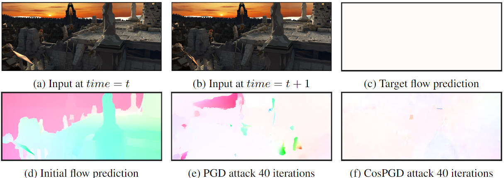

# CosPGD



## Introduction

While neural networks allow highly accurate predictions in many tasks, their lack of robustness towards even slight input perturbations hampers their deployment in many real-world applications.
Recent research towards evaluating the robustness of neural networks such as the seminal projected gradient descent (PGD) attack and subsequent works have drawn significant attention, as they provide an effective insight into the quality of representations learned by the network.
However, these methods predominantly focus on image classification tasks, while only a few approaches specifically address the analysis of pixel-wise prediction tasks such as semantic segmentation, optical flow, disparity estimation, and others, respectively. 

Thus, there is a lack of a unified adversarial robustness benchmarking tool (algorithm) that is applicable to all such pixel-wise prediction tasks.
In this work, we close this gap and propose CosPGD, a novel white-box adversarial attack that allows optimizing dedicated attacks for any pixel-wise prediction task in a unified setting.
It leverages the cosine similarity between the distributions over the predictions and ground truth (or target) to extend directly from classification tasks to regression settings. 
We outperform the SotA on semantic segmentation attacks in our experiments on PASCAL VOC2012.
Further, we set a new benchmark for adversarial attacks on optical flow displaying the ability to extend to any pixel-wise prediction task.

For more details please see our [Arxiv paper](https://arxiv.org/abs/2302.02213) (NOT ANONYMOUS).

## Contents

In this repository we provide sample code for comparing CosPGD to other adversarial attacks on different networks and downstream tasks.

The functions for the benchmarking tool are present in the [cospgd folder](https://github.com/shashankskagnihotri/cospgd/tree/main/cospgd)

A sample use of the CosPGD benchmarking tool is provided with instructions in the [unet_backbones folder](https://github.com/shashankskagnihotri/cospgd/tree/main/unet_backbones)

## Referece
If you use our work, we would appreciate if you cite the following BibTeX citation:
```
@misc{agnihotri2023cospgd,
      title={CosPGD: a unified white-box adversarial attack for pixel-wise prediction tasks}, 
      author={Shashank Agnihotri and Steffen Jung and Margret Keuper},
      year={2023},
      eprint={2302.02213},
      archivePrefix={arXiv},
      primaryClass={cs.CV}
}
```
