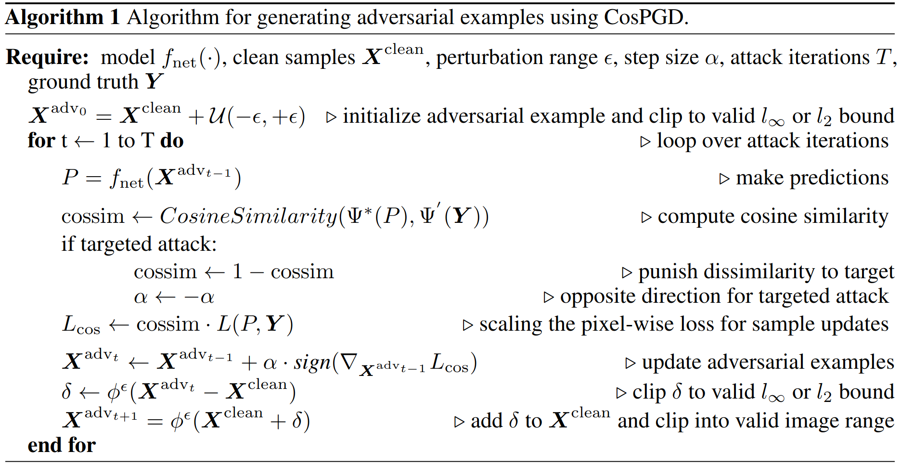

# CosPGD: a unified white-box adversarial attack for pixel-wise prediction tasks
The algorithm for generating adversarial samples using the CosPGD attack is as follows:




## Introduction

While neural networks allow highly accurate predictions in many tasks, their lack of robustness towards even slight input perturbations hampers their deployment in many real-world applications.
Recent research towards evaluating the robustness of neural networks such as the seminal projected gradient descent (PGD) attack and subsequent works have drawn significant attention, as they provide an effective insight into the quality of representations learned by the network.
However, these methods predominantly focus on image classification tasks, while only a few approaches specifically address the analysis of pixel-wise prediction tasks such as semantic segmentation, optical flow, disparity estimation, and others, respectively. 

Thus, there is a lack of a unified adversarial robustness benchmarking tool (algorithm) that is applicable to all such pixel-wise prediction tasks.
In this work, we close this gap and propose CosPGD, a novel white-box adversarial attack that allows optimizing dedicated attacks for any pixel-wise prediction task in a unified setting.
It leverages the cosine similarity between the distributions over the predictions and ground truth (or target) to extend directly from classification tasks to regression settings. 
We outperform the SotA on semantic segmentation attacks in our experiments on PASCAL VOC2012.
Further, we set a new benchmark for adversarial attacks on optical flow displaying the ability to extend to any pixel-wise prediction task.

For more details please see our [Arxiv paper](https://arxiv.org/abs/2302.02213).

## Installation

Install the package from PyPI:
```
pip install cospgd
```

## Usage
Sample code for usage for semantic segmentation using UNet has been provided at [cospgd/unet_backbones](https://github.com/shashankskagnihotri/cospgd/tree/main/unet_backbones)

Simple usage could be as follows:
```
import cospgd
from cospgd import functions
```

Following are the included functionalities:

1. Function to take one attack step in the l-infinity norm constraint:
```
functions.step_inf(
    perturbed_image: Float tensor of shape [batch size, channels, (image spatial resolution)]
    epsilon: Float tensor, permissible epsilon range
    data_grad: gradient on the image input to the model w.r.t. the loss backpropagated
    orig_image: Float tensor of shape [batch size, channels, (image spatial resolution)], Original unattacked image, before adding any noise
    alpha: Float tensor, attack step size
    targeted: boolean: Targeted attack or not
    clamp_min: Float tensor, minimum clip value for clipping the perturbed image back to the permisible input space
    clamp_max: Float tensor, maximum clip value for clipping the perturbed image back to the permisible input space
    grad_scale: tensor either single value or of the same shape as data_grad, to scale the added noise
)
```

2. Function to take one attack step in the l2 norm constraint:
```
functions.step_l2(
    perturbed_image: Float tensor of shape [batch size, channels, (image spatial resolution)]
    epsilon: Float tensor, permissible epsilon range
    data_grad: gradient on the image input to the model w.r.t. the loss backpropagated
    orig_image: Float tensor of shape [batch size, channels, (image spatial resolution)], Original unattacked image, before adding any noise
    alpha: Float tensor, attack step size
    targeted: boolean: Targeted attack or not
    clamp_min: Float tensor, minimum clip value for clipping the perturbed image back to the permisible input space
    clamp_max: Float tensor, maximum clip value for clipping the perturbed image back to the permisible input space
    grad_scale: tensor either single value or of the same shape as data_grad: to scale the added noise
)   
```

3. Function to clamp noise in the l-p norm constraint:
```
functions.lp_normalize(    
    noise: tensor of shape [batch size, (image spatial resolution)], the noise to be clamped
    p: int: the norm
    epsilon: Float tensor, permissible epsilon range
    decrease_only: boolean: to only clamp the upper bound and not the lower bound
)
```

4. Function to initialize noise in the l-infinity norm constraint:
```
functions.init_linf(
    epsilon: Float tensor, permissible epsilon range
    images: Float tensor of shape [batch size, channels, (image spatial resolution)], Original unattacked image, before adding any noise    
    clamp_min: Float tensor, minimum clip value for clipping the perturbed image back to the permisible input space
    clamp_max: Float tensor, maximum clip value for clipping the perturbed image back to the permisible input space    
)
```

5. Function to initialize noise in the l-2 norm constraint:
```
functions.init_l2(
    epsilon: Float tensor, permissible epsilon range
    images: Float tensor of shape [batch size, channels, (image spatial resolution)], Original unattacked image, before adding any noise    
    clamp_min: Float tensor, minimum clip value for clipping the perturbed image back to the permisible input space
    clamp_max: Float tensor, maximum clip value for clipping the perturbed image back to the permisible input space
)
```

6. Function to implement scaling of the pixel-wise loss as proposed by [SegPGD](https://arxiv.org/abs/2207.12391):     
```
functions.segpgd_scale(
    predictions: Float tensor of shape [batch size, channel, (image spatial resolution)], Predictions made by the model
    labels: The ground truth/target labels, for semantic segmentation index tensor of the shape [batch size, channel, (image spatial resolution)].
                                        for pixel-wise regression tasks, same shape as predictions
    loss: Float tensor, The loss between the predictions and the ground truth/target
    iteration: Current attack iteration for calculating lambda as used in SegPGD
    iterations: Total number of attack iterations for calculating lambda as used in SegPGD
    targeted: boolean, Targeted attack or not
)    
```

7. Function to implement scaling of the pixel-wise loss as proposed by [CosPGD](https://arxiv.org/abs/2302.02213):
```
functions.cospgd_scale(
    predictions: Float tensor of shape [batch size, channel, (image spatial resolution)], Predictions made by the model
    labels: The ground truth/target labels, for semantic segmentation index tensor of the shape [batch size, channel, (image spatial resolution)].
                                        for pixel-wise regression tasks, same shape as predictions
    loss: Float tensor, The loss between the predictions and the ground truth/target
    num_classes: int, For semantic segmentation the number of classes. None for pixel-wise regression tasks
    targeted: boolean, Targeted attack or not
    one_hot: boolean, To use one-hot encoding, SHOULD BE TRUE FOR SEMANTIC SEGMENTATION and FALSE FOR pixel-wise regression tasks    
)
```

